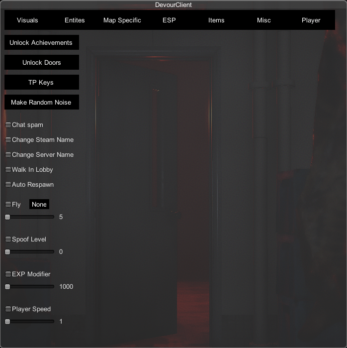

# Unknowncheats thread [here](https://www.unknowncheats.me/forum/other-fps-games/475950-devour-multihack-update.html)

# /!\ READ THIS
This is the branch for the V2 of the cheat, this branch will be the one updated if the MelonLoader version gets outdated (happened before).
For now, use the MelonLoader branch :)
The v2 is still in development.

# DevourClient

Devour client is a cheat for the game DEVOUR. It is written in C++.

## Detection rate

Not detected.

## Menu

## Features
Everything about spoofing ehre (steam name, server name, level...) will persist if you don't uncheck it (it will be reseted when you'll restart the game obv).
* An IMGUI menu thanks to UnityEngine
* Fully compatible with the new IL2CPP version of the game
* Detects if you're in game (with bad code lol), so no chances of crashing on main menu by activating features
* Detects the map you are playing on (useful for the instant win)
* Big Flashlight (allows your flashlight to light a lot more)
* Flashlight color customization
* Unlimited UV light (thanks to [@jadis0x](https://github.com/jadis0x))
* A chat spammer for Lobby and InGame chat
* Achievements unlocker (couldn't do all of them, my code is crashing for some reasons at some point, i may fix it, for now it's commented out)
* Doors unlocker (should work fine, though it doesn't seem to work sometimes)
* Keys teleporter
* LV 70 (puts you to the max level of the game !)
* LV 666 (secret level, thanks to the guy who told me it exists lol)
* Steam name spoofer
* Server name spoofer
* Fly !! YES ! YOU CAN FLY ! You can also change the speed of it (left shift : down, space : up, up arrow : forward, back arrow : backward, left arrow : left, right arrow : right)
* Unlock all, including flashlights, perks, outfits. Active by default, can't be turned off, no persistance.
* Instant Win (allows you to win instantaniously on any map, works in singleplayer, but not as a client. May be working as host)
* Random Sound (make your character play a random acting sound)
* Always carrying a medkit
* Change your exp at the end of the game, changing it is permanant !
* Player ESP
* Player snaplines
* Azazel ESP
* Azazel snapline
* Item ESP
* Demon ESP
* Goat/Rat ESP
* TP all the items to your position ! (thanks to [@jadis0x](https://github.com/jadis0x))
* Spawn any item/entity to your position
* Walk in the lobby
* Change the player's speed
* Fullbright

## Installation
In order to get all of this working you need to generate the DevourClient.dll file by building the source code.

0. [Build the cheat from source](https://github.com/ALittlePatate/DevourClient#building-from-source).
1. Inject the DevourClient.dll file located in `DevourClient\x64\Release` to DEVOUR with your favourite injector //TODO code an injector.
2. Use INSERT to open the menu

Alternatively, you can watch this video :

## Building from source

0. Clone the repository (or Code -> Download Zip)
1. Open the DevourClient.sln file in Visual Studio 2022
2. Go at the top of the window, change Debug to Release and set the architecture to x64
3. Go to Build --> Build solution

## Contact

You can add me on discord at patate#1252

## Code used

Library used to hack IL2CPP from C++ at runtime :
* [IL2CPP Resolver](https://github.com/sneakyevilSK/IL2CPP_Resolver)

For teaching me the basics :
* [A Begginner's Guide To Hacking Unity Games](https://www.unknowncheats.me/wiki/A_Beginner%27s_Guide_To_Hacking_Unity_Games)

For teaching me about the UnityEngine API :
* [Unity User Manual 2020.3 (LTS)](https://docs.unity3d.com/Manual/index.html)

For decompiling and looking in the source code of the game :
* [dnSpy : a .NET debugger and assembly editor](https://github.com/dnSpy/dnSpy)

Game's last update before il2cpp :
* https://steamdb.info/depot/1274571/history/?changeid=M:1960656865974212833

## Contributing

Open an [issue](https://github.com/ALittlePatate/DevourClient/issues/new) or make a [pull request](https://github.com/ALittlePatate/DevourClient/pulls), i'll be glad to improve my project with you !

## License

[GPL 3.0](https://www.gnu.org/licenses/gpl-3.0.md)
